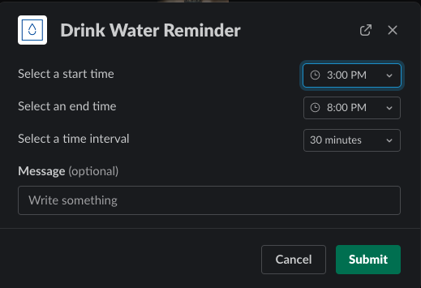
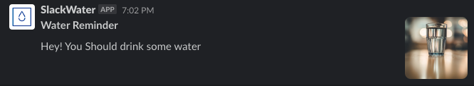

# Slack Water

## Setting up credentials
Run
```sh
$ EDITOR='code --wait' rails credentials:edit
```

Edit the file with:
```
slack:
  token: <YOUR_SLACK_TOKEN>
  channel_id: <YOUR_CHANNEL_ID>
```

## Running locally
### 1. Start ngrok
In order to receive incoming requests locally, we can use `ngrok`, which allows us to tunnel requests from a public URL into our local development system.
```sh
$ ngrok http 3000
```

### 2. Configure URL in Slack API
The URL generated by ngrok should be set in Slack:
- In Interactivity & Shortcuts (Request URL: `<NGROK_URL>/interaction`)
- In Slash Commands (Request URL: `<NGROK_URL>/reminder`)

Add the host to `environments/development.rb`:
```
config.hosts << <NGROK_URL>
```

### 3. Run docker-compose
To get your containers running, run:
```sh
$ docker-compose up
```

### 4. Call bot in Slack
After adding the Slack bot to your channel, call it with `/remind_water`.

## Images
Slack Modal:



Example Reminder:


